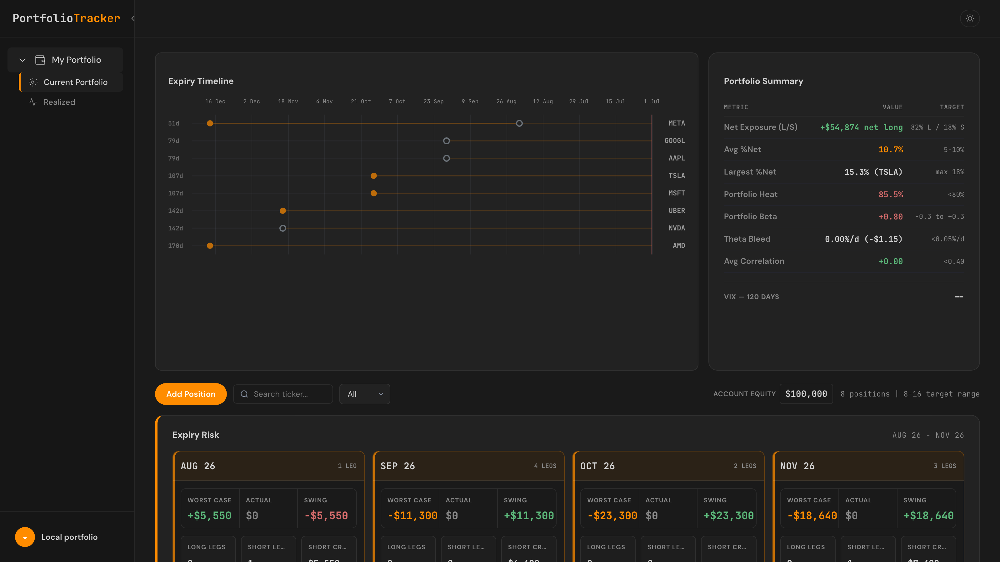
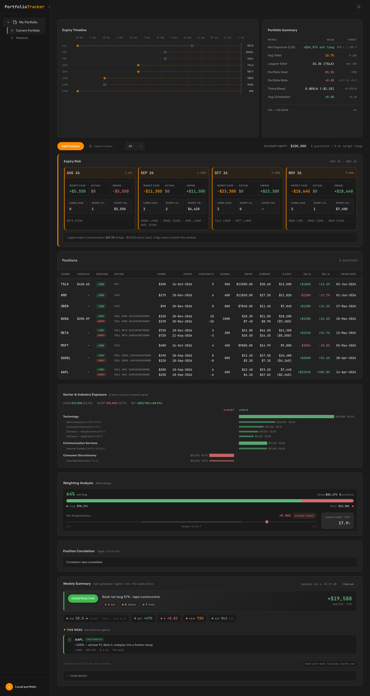
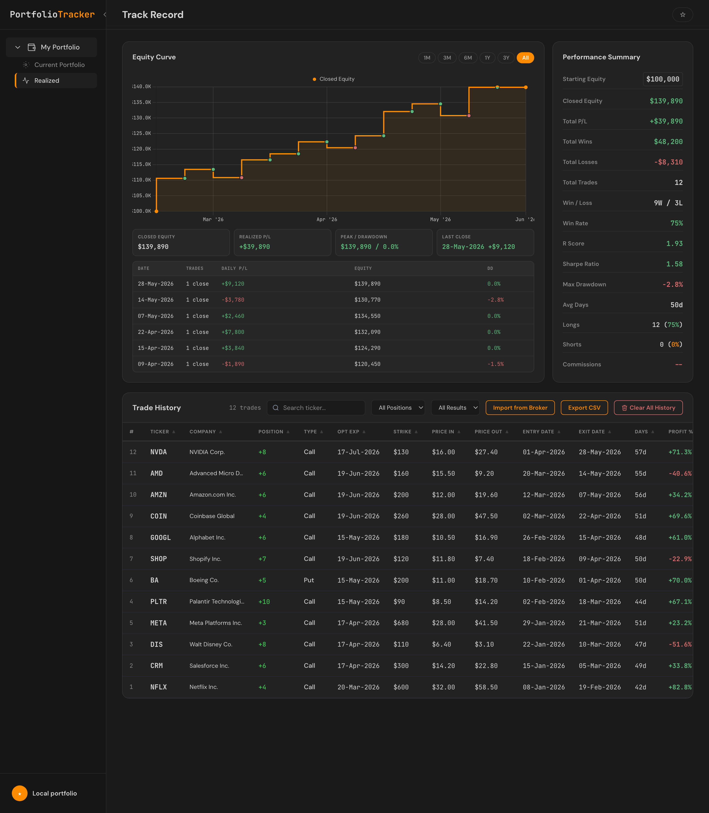
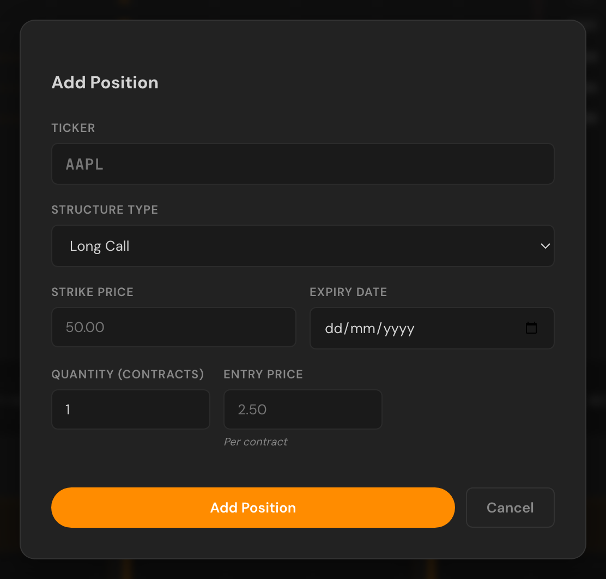

# Portfolio Tracker

**A self-hosted options & equity portfolio tracker** — live mark-to-market P&L,
expiry-risk analysis, and a realized track record. Runs on your own machine with
**no accounts and no login**, and ships with a synthetic demo portfolio so it
works the moment you start it. No API keys are required to use it — and if you
want, you can [link a TradeStation account](#connect-tradestation-optional) so
your open positions and balances update **automatically**.


-orange)
-ff8c00)



> ⚠️ The bundled positions and trades are **fictional demo data** for
> illustration only. Nothing here is investment advice.

---

## Contents

- [What it does](#what-it-does)
- [Screenshots](#screenshots)
- [Quick start](#quick-start)
- [How it works](#how-it-works)
- [Managing positions](#managing-positions)
- [Connect TradeStation (optional)](#connect-tradestation-optional)
- [Tests](#tests)
- [Configuration](#configuration)
- [Project structure](#project-structure)
- [Tech stack](#tech-stack)
- [Contributing](#contributing)
- [License](#license)

---

## What it does

Two pages, both live the moment you start the server:

- **Current Portfolio** — your open book with live(ish) option marks, per-leg
  Greeks, net exposure / heat / beta, an expiry timeline, an **expiry-risk**
  panel (worst-case per expiration), a sector & industry exposure breakdown, a
  weighting analysis, and an auto-generated weekly summary.
- **Realized** — a track record of closed trades: equity curve, win rate,
  R-score, Sharpe, max drawdown, and a sortable, searchable trade history.

It runs entirely on your own machine. Your positions never leave it — the only
outbound calls fetch **public** market data (Yahoo / FRED). Replace the demo
data with your own and it becomes your private book.

---

## Screenshots

### Current Portfolio

A single-screen read on the whole open book.



| Panel | What it shows |
|-------|---------------|
| **Expiry Timeline** | Every leg plotted by days-to-expiry, so the next expiration wall is obvious at a glance. |
| **Portfolio Summary** | Net exposure (long/short split), avg %net, largest position, portfolio heat, beta, theta bleed, correlation — each against a target band. |
| **Expiry Risk** | Per-expiration cards with worst-case / actual / swing $ and the leg breakdown, flagging your largest expiry concentration. |
| **Positions** | Every position with live underlying, modeled option mark, cost basis, and open P&L ($ and %), color-coded long/short per leg. |
| **Sector & Industry Exposure** | Long vs. short gross capital by sector and industry as diverging bars. |
| **Weighting Analysis** | Net-long %, gross exposure, net-weighted beta vs. target, and largest single-name weight. |
| **Weekly Summary** | An auto-generated, regime-aware read on the book (constructive / cautious) with this-week actions ranked by urgency. |

### Realized

A full track record of everything you've closed.



| Panel | What it shows |
|-------|---------------|
| **Equity Curve** | Closed equity over time (1M / 3M / 6M / 1Y / 3Y / All), starting from your configured capital. |
| **Performance Summary** | Total P&L, wins/losses, win rate, R-score, Sharpe ratio, max drawdown, average hold, long/short split. |
| **Daily P/L** | Per-day realized P&L, running equity, and drawdown. |
| **Trade History** | Every closed trade — ticker, structure, entry/exit, days held, and % return — sortable, searchable, and CSV-exportable. Import closed trades from a broker CSV/PDF. |

---

## Quick start

Requires **Node.js 20+** (the `better-sqlite3` native module needs 20 or newer).

```bash
git clone https://github.com/Rayha33/portfolio-tracker.git
cd portfolio-tracker
npm install
npm start
```

Then open **http://localhost:3000**.

On first run the app creates a local SQLite database (`db/portfolio.db`) and
seeds it with the demo portfolio. That's it — both pages are live.

To wipe the demo data and start from your own book:

```bash
npm run reseed   # re-create the demo data, OR
```

…just delete the demo positions in the UI and add your own with **Add Position**.

---

## How it works

```
Browser (portfolio.html / track-record.html)
        │  fetch /api/...
        ▼
Express server (server.js)
        ├─ routes/positions.js     open/closed positions, quote cache, close flow
        ├─ routes/track.js         realized track record + aggregate stats
        ├─ routes/market.js        live quotes + Black-Scholes option marks
        ├─ routes/tradestation.js  optional TradeStation link (OAuth + auto-sync)
        └─ routes/misc.js          export, earnings, VIX/FRED passthrough
        ▼
SQLite (db/portfolio.db)  ← created & seeded automatically
```

### Where prices come from

There is no paid data feed. Prices are best-effort and **fail soft**:

| Data | Source | Fallback if offline |
|------|--------|---------------------|
| Underlying stock prices | Yahoo Finance (keyless) | last cached value, then the mark stored on the position |
| Option marks & Greeks | **Black-Scholes**, computed from the live underlying + its realized volatility | the entry/stored mark |
| VIX history & term structure | Yahoo + FRED (keyless) | neutral defaults; the panel degrades |

Because option marks are modeled (no free options chain exists), P&L moves with
the **real underlying** but is a theoretical value, not a broker quote. Set
`ENABLE_LIVE_QUOTES=0` to run fully offline with frozen prices.

### Your data stays local

Everything lives in `db/portfolio.db` on your machine. The app makes outbound
requests only to fetch public market data (Yahoo / FRED). It never sends your
positions anywhere. There is no telemetry and no account system.

---

## Managing positions

<p align="center"></p>

- **Add Position** — opens a builder for single options or multi-leg structures
  (verticals, calendars, …). Enter ticker, legs, strikes, expiries, premiums.
- **Close** a position (full or partial) — it moves to the Realized page and its
  P&L is booked into the track record.
- **Import from Broker** — drag a broker CSV/PDF onto the Realized page to bulk-load
  closed trades.
- **Export CSV** — download your open book or trade history.

Every change is a normal API call backed by SQLite, so the data survives restarts.

## Connect TradeStation (optional)

The tracker works fully without any broker link — enter trades by hand or import
a CSV. **Linking a TradeStation account is optional**; it just makes things
automatic: once connected, your open **options** book and account balances sync
on their own on a timer (plus a **Sync now** button for on-demand refresh), so
the Current Portfolio page mirrors your live account with no manual entry.

It's a one-time setup, then hands-off:

1. **Create a TradeStation API key.** In the TradeStation Developer portal,
   create an API Key (you get a **Client ID** and **Client Secret**). Add this
   exact **Callback URL** to the key:

   ```
   http://localhost:3000/api/tradestation/callback
   ```

   (If you run on a different address, set `APP_BASE_URL` — the panel always
   shows the exact URL to register.)

2. **Paste it in.** On the Current Portfolio page, the **TradeStation Live**
   panel has a short form: choose **Simulated** (paper) or **Live**, paste your
   Client ID and Secret, and click **Connect TradeStation**.

3. **Approve once.** You're sent to TradeStation to authorize read access, then
   redirected straight back. From then on the link refreshes itself — you never
   paste a token or re-run anything.

Once connected the panel shows account equity, cash, and P&L, and your open
options positions appear in the table automatically. The linked account
re-syncs on a timer (every ~5 min by default, `TRADESTATION_SYNC_SECONDS`);
use **Sync now** for an on-demand refresh or **Disconnect** to unlink.

**Good to know**

- **Read-only.** The link requests read-only scopes — `ReadAccount` and
  `MarketData` — plus `openid`/`profile` for sign-in and `offline_access` for
  token refresh. It never requests a trading scope, so the app cannot place or
  modify orders.
- **Options-focused.** Only option positions are mirrored into the table (this
  is an options tracker); the panel notes how many non-option lots, e.g. shares,
  weren't shown. Your **Realized page is untouched** by syncing.
- **The broker drives your open book.** Connecting clears the demo positions,
  then each sync replaces the TradeStation-sourced rows with your live account.
  Any positions you added by hand are kept; while linked, open and close
  positions at TradeStation and let the sync mirror them.
- **Local & self-hosted.** Your API key, secret, and tokens are stored in your
  local `db/portfolio.db` and used only to talk to TradeStation directly from
  your machine. Keep that file private (it is git-ignored by default).

## Tests

```bash
npm test
```

Two dependency-free suites run with `npm test` (no network, no API keys):

- **Unit** (`test/tradestation.test.mjs`) — the TradeStation mappers
  (option-symbol parsing, position → row, balance normalization) and the
  OAuth-URL / credential logic, against a throwaway database.
- **Smoke** (`test/smoke.mjs`) — boots the real server against a throwaway
  database, asserts both pages and the core APIs serve the seeded demo data,
  exercises the add → close → delete write path, and checks the TradeStation
  link endpoints in their disconnected state.

Both run clean on Node 20, 22, and 24.

## Configuration

All optional — copy `.env.example` to `.env` to change any of it:

| Variable | Default | Purpose |
|----------|---------|---------|
| `PORT` | `3000` | Web server port |
| `PORTFOLIO_DB_PATH` | `./db/portfolio.db` | Database location |
| `ENABLE_LIVE_QUOTES` | `1` | Set `0` to run fully offline |
| `RISK_FREE_RATE` | `0.045` | Risk-free rate for the option model |
| `DEFAULT_IV` | `0.55` | Fallback vol when history is unavailable |
| `STARTING_CAPITAL` | `20000` | Equity-curve starting capital |
| `APP_BASE_URL` | `http://localhost:3000` | Address used to build the TradeStation OAuth callback URL |
| `TRADESTATION_SYNC_SECONDS` | `300` | How often the linked account auto-syncs (min 60) |

## Project structure

```
portfolio-tracker/
├── server.js              Express entry point
├── lib/
│   ├── db.js              SQLite connection + schema bootstrap
│   ├── auth.js            single-user shim (no login)
│   ├── quotes.js          Yahoo/FRED quote + history fetcher (cached, fail-soft)
│   ├── options.js         Black-Scholes price + Greeks
│   ├── response-cache.js  tiny in-memory response cache
│   ├── portfolio-config.js
│   └── tradestation.js    optional TradeStation OAuth + auto-sync client
├── routes/                positions, track, market, tradestation, misc
├── db/
│   ├── schema.sql         tables (idempotent; incl. tradestation_auth)
│   └── seed.js            synthetic demo data generator
├── public/
│   ├── portfolio.html     Current Portfolio page (incl. TradeStation Live panel)
│   ├── track-record.html  Realized page
│   └── css/ js/ shared.js …
├── test/
│   ├── tradestation.test.mjs  TradeStation mapper/OAuth unit tests
│   └── smoke.mjs              boots the server & checks pages + APIs (npm test)
└── docs/screenshots/      images used in this README
```

## Tech stack

- **Node.js + Express** — tiny JSON API, no framework beyond Express.
- **better-sqlite3** — fast synchronous SQLite (ships prebuilt binaries).
- **Vanilla HTML/CSS/JS** front end + **Chart.js** (via CDN). No build step.

## Contributing

Issues and pull requests are welcome — see [CONTRIBUTING.md](CONTRIBUTING.md).
Please run `npm test` before opening a PR. Notable changes are tracked in
[CHANGELOG.md](CHANGELOG.md).

## License

[MIT](LICENSE).
